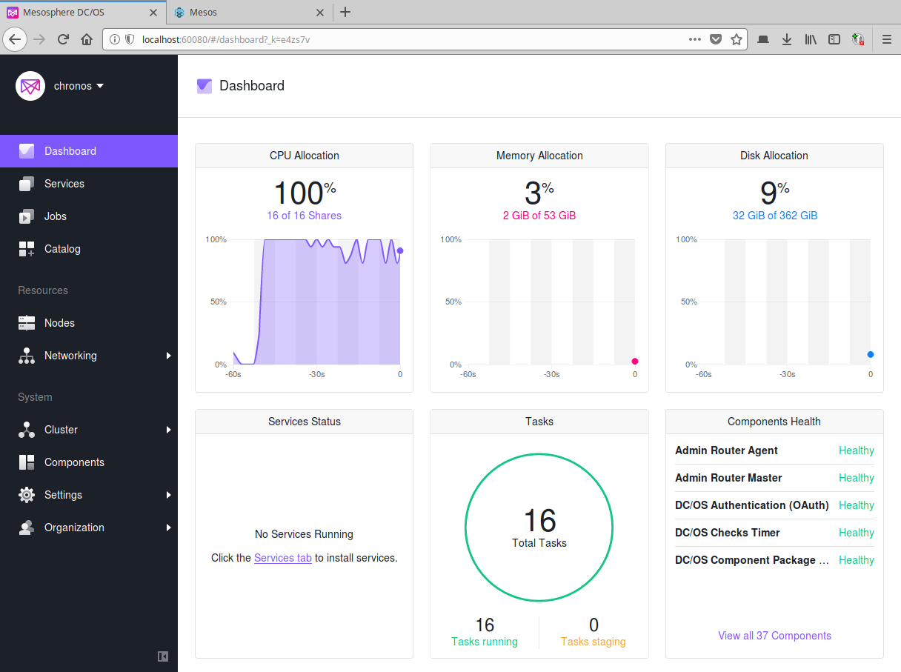
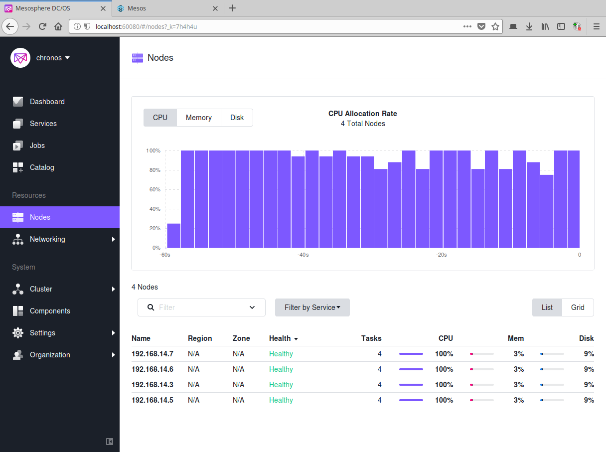
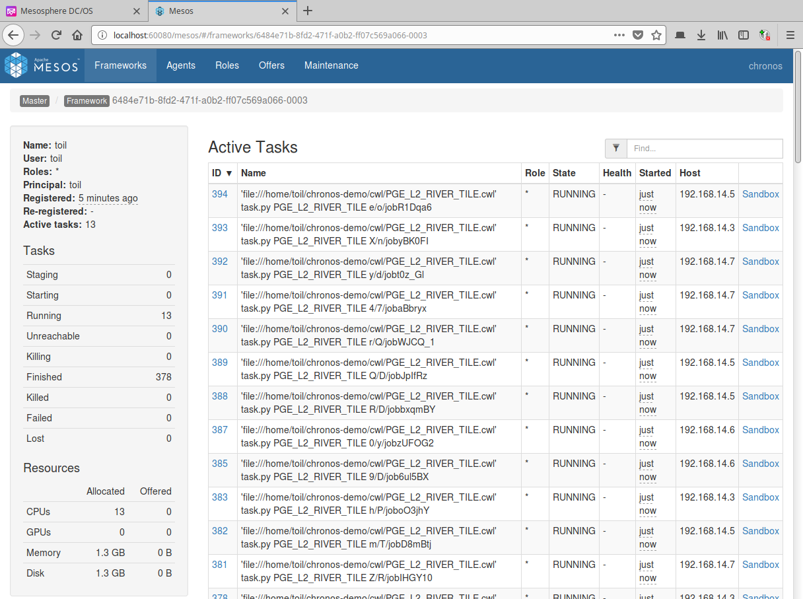

# CWL example

See CWL graph rendered at
https://view.commonwl.org/workflows/github.com/CS-SI/chronos-demo/blob/f4dff46/cwl/KARIN_HR.cwl

 

## Test locally

### Install

```bash
cd
# Clone current project
git clone https://github.com/CS-SI/chronos-demo

# Create a virtual environment
virtualenv cwltool
source cwltool/bin/activate
pip install cwltool

# Add task and tools in PATH
mkdir -p ~/.local/bin
# add ~/.local/bin into PATH
ln -s ~/chronos-demo/pge/task.py ~/.local/bin
ln -s ~/chronos-demo/init_input.sh ~/.local/bin
ln -s ~/chronos-demo/init_args.py ~/.local/bin

# Create a job working dir
WDIR=work_$(date '+%Y%m%d-%H%M%S')
mkdir $WDIR
cd $WDIR

# Initialize sample input files and create args.json with path to that sample files
init_input.sh 1 input
init_args.py input
```

### Run

```bash
cwltool ~/chronos-demo/cwl/KARIN_HR.cwl args.json
```

## Run on the cloud

Safescale cloud management platform can be used to deploy a Toil-Mesos cluster automatically on a cloud provider infrastructure.

See https://github.com/CS-SI/SafeScale

### Deploy Mesos cluster

Run `chronos_deploy.sh` to get a Mesos cluster up and running. The script also executes to required configuration to execute the CWL graph.

```bash
./chronos_deploy.sh fe  # Flexible Engine with 2 Mesos agent nodes
./chronos_deploy.sh ovh 4  # OVH with 4 Mesos agent nodes
```

### Run CWL graph

```bash
# Start Safescale broker daemon
brokerd
broker tenant list
broker tenant set ovh
# List cluster host names
broker host list|jq -r '.[].Name'
# Connect to Mesos master host
broker ssh connect chronos-master-1

sudo su - toil

# Create job working dir
WDIR=work_$(date '+%Y%m%d-%H%M%S')
mkdir ~/$WDIR
cd ~/$WDIR

# Run CWL job with Toil
cwltoil \
    --jobStore=file:/data/toil/job_stores/my-job-store \
    --batchSystem=mesos \
    --mesosMaster=<mesos_master_host>:5050 \
    ../chronos-demo/cwl/KARIN_HR.cwl \
    ../chronos-demo/args.json
```

Output files are generated into current work directory.

If required, run `toil clean /data/toil/job_stores/my-job-store/` to cleanup job store folder.

### Monitoring

Create a SSH tunnel to Mesos master host with settings:

```
LocalForward 60443 <mesos_master_host>:443
LocalForward 60080 <mesos_master_host>:80
```

Access to:

* DC/OS dashboard at http://localhost:60080



 

* Mesos dashboard at http://localhost:60080/mesos

 

### Run Python Toil graph

A Toil job Python script is also provided as an example. To run it, execute:

```bash
cd chronos-demo
python hello_world_multi.py \
    file:/data/toil/job_stores/my-job-store \
    --batchSystem=mesos \
    --mesosMaster=<mesos_master_host>:5050
```
